# Dockmaster: Reintroduction Guide

## 1. Executive Summary

Dockmaster is a centralized authentication and authorization system you built for service-to-service communication on GCP. It has two components:

- **Python client library** (`dockmaster/`, v0.14.0) -- issues and verifies JWTs using GCP service account keys, provides Flask middleware for OAuth browser login with Redis-backed sessions, and enforces role-based access control (RBAC) stored in GCP Secret Manager.
- **Flask microservice** (`service/dockmaster_service/`, v0.12.3) -- the centralized token mint and RBAC authority. Exchanges Google OAuth/access tokens for internally-signed Dockmaster JWTs, serves public keys for distributed verification, and exposes RBAC permission checks over HTTP.

**Why it exists:** Every service in the system uses the same JWT format signed by the same key. Browser users authenticate via Google OAuth, get a Dockmaster JWT, and use it to call any backend service. Service accounts mint their own JWTs directly. RBAC is centralized -- services ask dockmaster "can this subject do X on my service?" rather than implementing their own authorization.

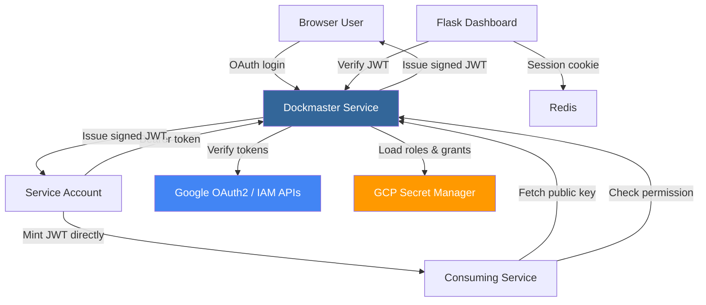

---

## 2. Architecture Deep Dive

### 2a. Component Architecture

| Module | File | Purpose |
|--------|------|---------|
| Token issuance | `dockmaster/client.py` | `ServiceUser` creates signed JWTs from service account credentials |
| Token verification | `dockmaster/target.py` | `ServiceRealm` verifies JWTs, `KeyCache` hierarchy manages public keys |
| RBAC | `dockmaster/rbac.py` | `Role`, `Grant`, `ServiceGrants`, `Authority`, `SecretsStorage` |
| Flask auth | `dockmaster/flask_integration.py` | OAuth redirect flow, session middleware, `/auth/*` Blueprint |
| Sessions | `dockmaster/sessions.py` | `RedisSessionInterface` -- server-side sessions with session ID cookie |
| CLI | `dockmaster/__main__.py` | `python -m dockmaster` for role/grant management |
| Service | `service/dockmaster_service/service.py` | HTTP endpoints: `/exchange`, `/refresh`, `/claims`, `/key/<kid>`, `/has` |

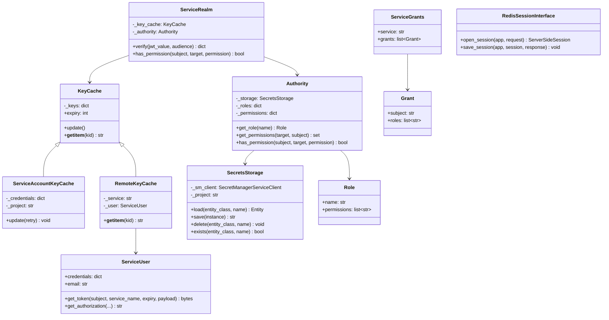

### 2b. Token Anatomy

A Dockmaster JWT contains these claims:

```json
{
  "iss": "dock-master@shipyard-auth-2022.iam.gserviceaccount.com",
  "sub": "sarah.chen@shipyard.com",
  "email": "sarah.chen@shipyard.com",
  "aud": "lims-api",
  "iat": 1709836800,
  "exp": 1709840400,
  "name": "Sarah Chen",
  "picture": "https://lh3.googleusercontent.com/...",
  "given_name": "Sarah",
  "family_name": "Chen",
  "locale": "en"
}
```

**Signing** (`client.py:72-78`): The `ServiceUser` creates an `RSASigner` from the service account's private key and calls `google.auth.jwt.encode(signer, payload)`. The JWT header includes the `kid` (key ID) from the service account.

**Verification** (`target.py:153-184`): `ServiceRealm.verify()` base64-decodes the JWT header to extract the `kid`, looks up the corresponding public key from the `KeyCache`, and calls `google.auth.jwt.decode(jwt_value, certs=key)`.

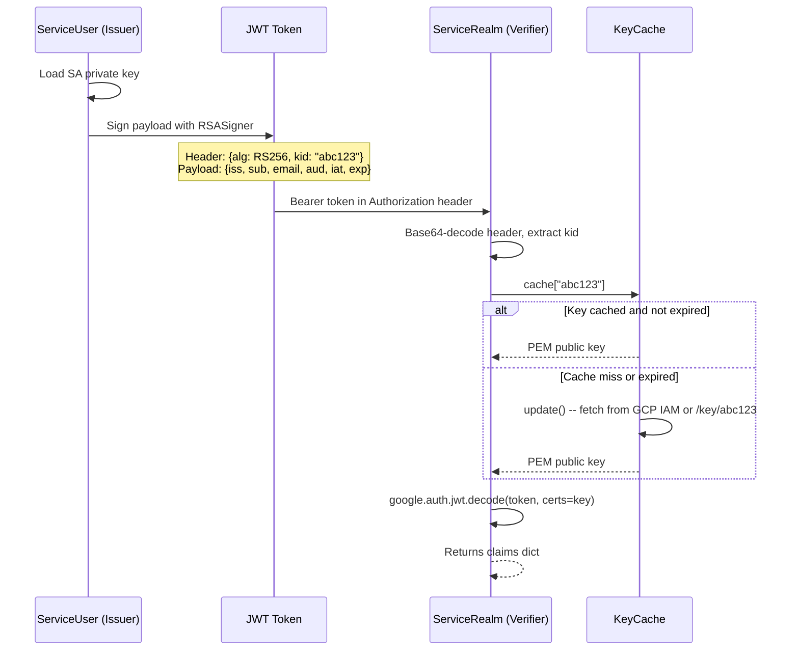

### 2c. Authentication Flows

#### Flow 1: Service-to-Service (Direct JWT)

A service with GCP credentials mints a JWT and sends it directly. No dockmaster service involved.

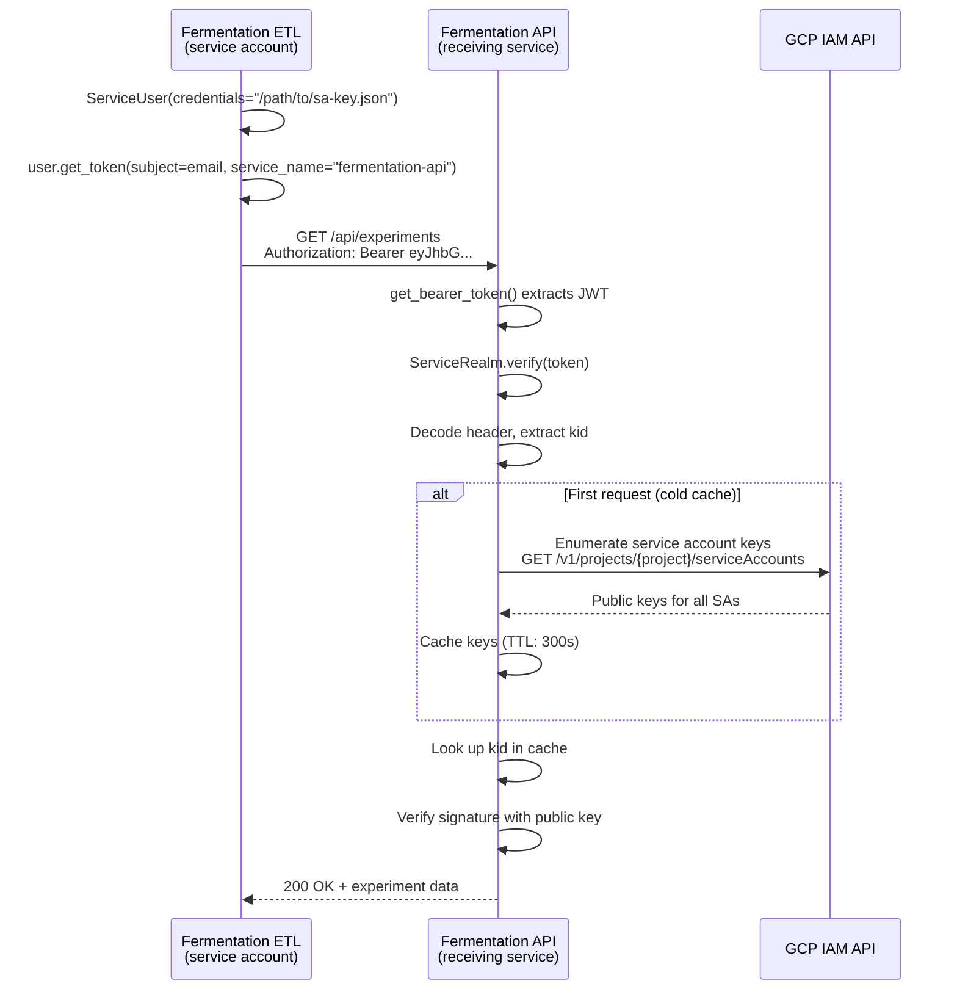

#### Flow 2: Browser OAuth (Flask Integration)

A Flask app using dockmaster's `login_authenticate` middleware redirects users to Google, then stores tokens in a Redis-backed session.

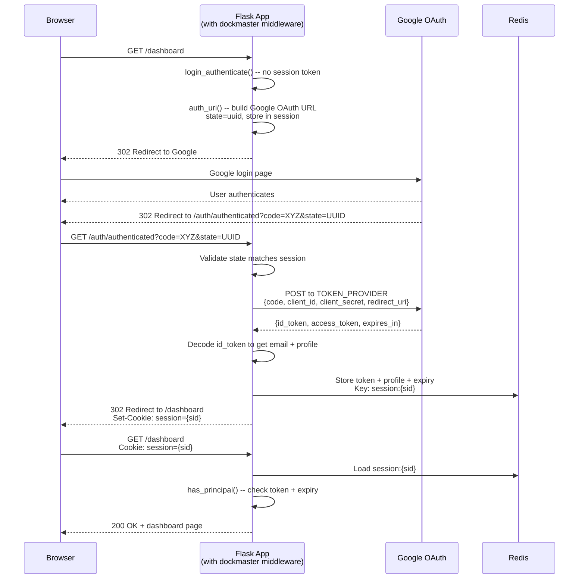

#### Flow 3: Token Exchange

A client with a Google token (JWT or access token) exchanges it for a Dockmaster JWT at the `/exchange` endpoint.

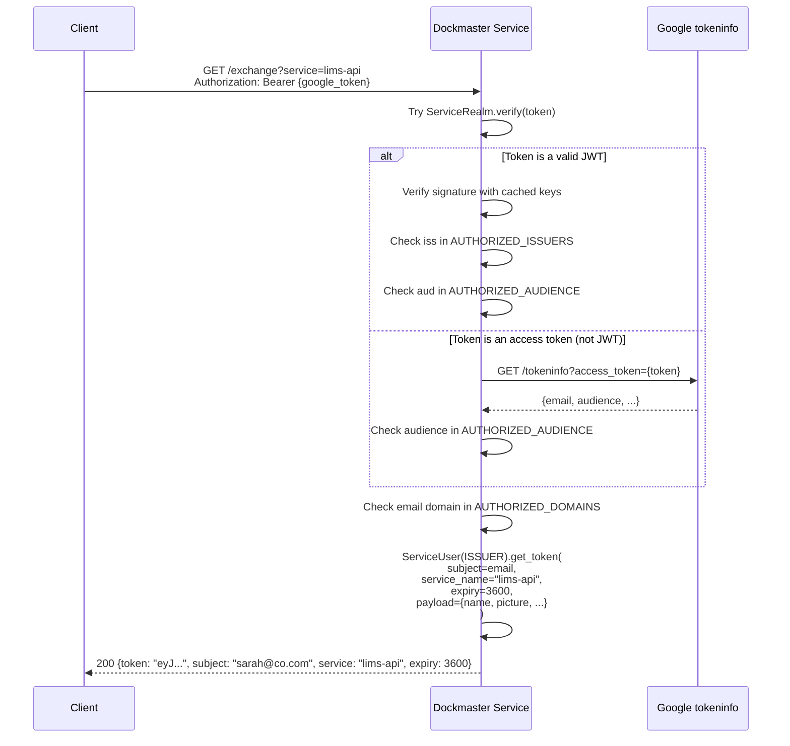

#### Flow 4: Token Refresh

A client with a Google refresh token gets a fresh Dockmaster JWT via the `/refresh` endpoint.

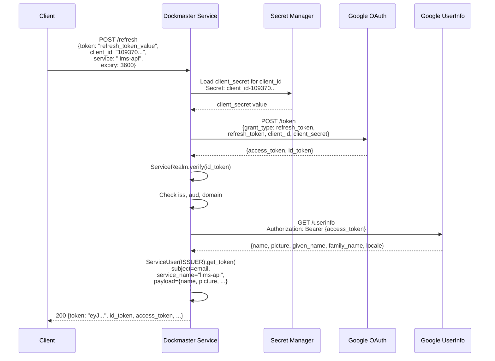

### 2d. RBAC Model

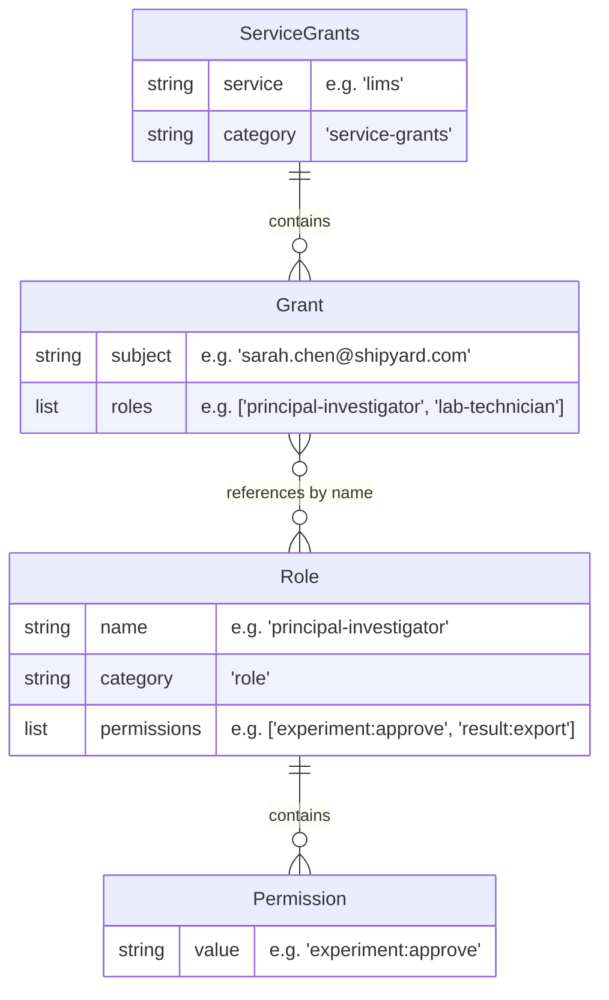

**Storage:** Each entity is stored as a versioned secret in GCP Secret Manager:
- Roles: `role-{name}` (e.g., `role-lab-technician`)
- Service grants: `service-grants-{service}` (e.g., `service-grants-lims`)

**Permission Resolution:**

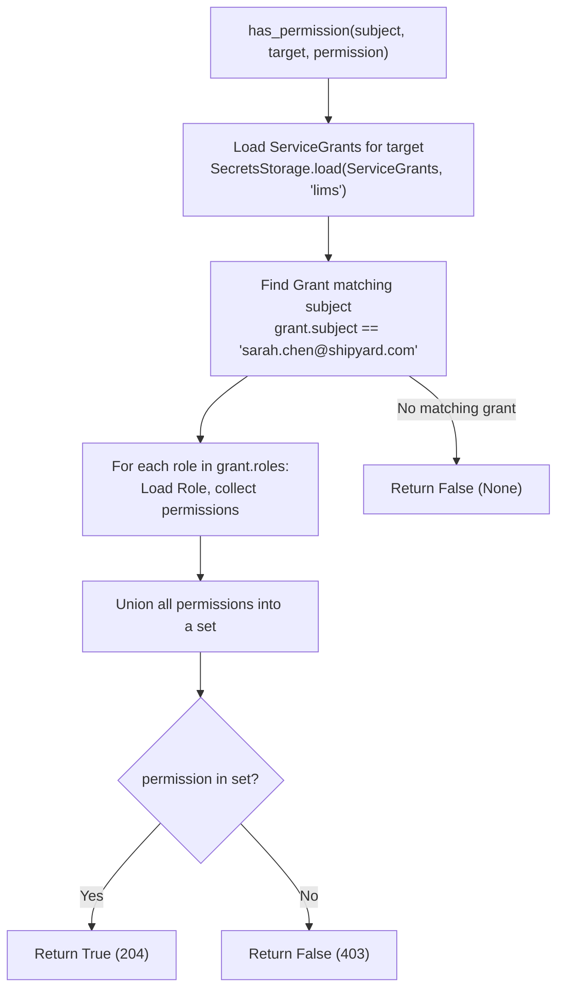

---

## 3. Tracer Bullet Case Studies

### Case Study 1: Fermentation Data Pipeline Authenticating to an API

**Scenario:** The fermentation ETL service (`fermentation-etl@shipyard-lab.iam.gserviceaccount.com`) needs to POST experimental results to the Fermentation API.

**Issuing side (ETL service):**

```python
from dockmaster import ServiceUser

# Load the service account key
user = ServiceUser("/etc/secrets/fermentation-etl-sa.json")
# user.email == "fermentation-etl@shipyard-lab.iam.gserviceaccount.com"

# Mint a JWT targeting the fermentation API
token = user.get_token(
    service_name="fermentation-api",
    expiry=3600
)
# token is bytes: b'eyJhbGciOiJSUzI1NiIsInR5cCI6IkpXVCIsImtpZCI6ImFiYzEyMyJ9...'

# Use it in a request
import requests
response = requests.post(
    "https://fermentation-api.internal/api/experiments/EXP-2024-042/results",
    headers={"Authorization": f"Bearer {token.decode('utf-8')}"},
    json={"ph": 6.8, "od600": 1.2, "temperature_c": 37.0}
)
```

The resulting JWT payload:

```json
{
  "iss": "fermentation-etl@shipyard-lab.iam.gserviceaccount.com",
  "sub": "fermentation-etl@shipyard-lab.iam.gserviceaccount.com",
  "email": "fermentation-etl@shipyard-lab.iam.gserviceaccount.com",
  "aud": "fermentation-api",
  "iat": 1709836800,
  "exp": 1709840400
}
```

**Receiving side (Fermentation API):**

```python
from dockmaster import ServiceRealm, ServiceAccountKeyCache

# Module-level singleton -- caches public keys, refreshes every 300s
key_cache = ServiceAccountKeyCache(
    credentials="/etc/secrets/api-sa.json",
    project="shipyard-lab"
)
realm = ServiceRealm(key_cache)

# In your Flask before_request or FastAPI dependency:
def authenticate(request):
    auth = request.headers.get("Authorization", "")
    if not auth.startswith("Bearer "):
        return None, "Missing Bearer token"

    token = auth[7:]
    try:
        claims = realm.verify(token)
        # claims["email"] == "fermentation-etl@shipyard-lab.iam.gserviceaccount.com"
        # claims["aud"] == "fermentation-api"
        return claims, None
    except ValueError as e:
        return None, str(e)
```

### Case Study 2: Researcher Logging into a Lab Dashboard

**Scenario:** Dr. Sarah Chen (`sarah.chen@shipyard.com`) opens the Lab Dashboard, which needs to call the Experiment API backend.

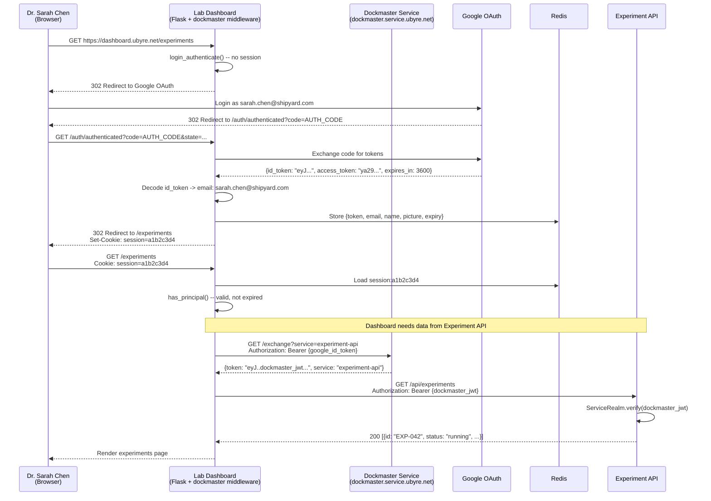

### Case Study 3: LIMS Permission Model

**Scenario:** A Laboratory Information Management System (LIMS) with three roles and granular permissions.

**Setting up roles via CLI:**

```bash
# Create roles with specific permissions
python -m dockmaster role create lab-technician \
    sample:create sample:read sample:update \
    instrument:operate \
    result:read

python -m dockmaster role create principal-investigator \
    experiment:create experiment:approve experiment:read \
    sample:read \
    result:read result:export result:sign

python -m dockmaster role create instrument-operator \
    instrument:calibrate instrument:operate instrument:status \
    result:read
```

**Granting roles to users:**

```bash
# Sarah is a PI and also does lab work
python -m dockmaster service grant lims \
    "sarah.chen@shipyard.com:principal-investigator,lab-technician"

# James is a technician and instrument specialist
python -m dockmaster service grant lims \
    "james.wu@shipyard.com:lab-technician,instrument-operator"

# The ETL service can read results
python -m dockmaster service grant lims \
    "fermentation-etl@shipyard-lab.iam.gserviceaccount.com:lab-technician"
```

**What gets stored in Secret Manager:**

`role-lab-technician`:
```json
{"kind": "Role", "name": "lab-technician", "permissions": ["sample:create", "sample:read", "sample:update", "instrument:operate", "result:read"]}
```

`role-principal-investigator`:
```json
{"kind": "Role", "name": "principal-investigator", "permissions": ["experiment:create", "experiment:approve", "experiment:read", "sample:read", "result:read", "result:export", "result:sign"]}
```

`service-grants-lims`:
```json
{
  "kind": "ServiceGrants",
  "service": "lims",
  "grants": [
    {"kind": "Grant", "subject": "sarah.chen@shipyard.com", "roles": ["principal-investigator", "lab-technician"]},
    {"kind": "Grant", "subject": "james.wu@shipyard.com", "roles": ["lab-technician", "instrument-operator"]},
    {"kind": "Grant", "subject": "fermentation-etl@shipyard-lab.iam.gserviceaccount.com", "roles": ["lab-technician"]}
  ]
}
```

**Permission check walkthrough:**

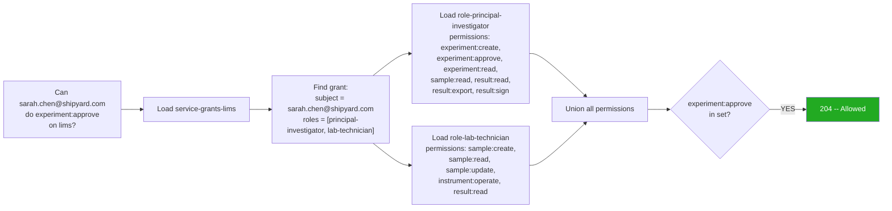

**HTTP check:**
```
GET /has/sarah.chen@shipyard.com/lims/experiment:approve
→ 204 (allowed)

GET /has/james.wu@shipyard.com/lims/experiment:approve
→ 403 {"message": "james.wu@shipyard.com does not have experiment:approve for lims"}

GET /has/james.wu@shipyard.com/lims/instrument:calibrate
→ 204 (allowed -- via instrument-operator role)
```

---

## 4. Use Case Walkthroughs

### Walkthrough: Service Account Mints a JWT

```python
from dockmaster import ServiceUser

# 1. Load credentials (file path, dict, or JSON)
user = ServiceUser("/path/to/service-account.json")

# 2. Mint a token
token = user.get_token(
    subject="sarah.chen@shipyard.com",  # optional: defaults to SA email
    service_name="lims-api",             # sets the 'aud' claim
    expiry=3600,                          # seconds (default: 1 hour)
    payload={"custom_claim": "value"}     # optional extra claims
)

# 3. Use as Bearer token
auth_header = user.get_authorization(service_name="lims-api")
# → "Bearer eyJhbGciOiJSUzI1NiIs..."
```

### Walkthrough: Using a JWT to Call a Protected Service

**Caller side:**
```python
import requests

response = requests.get(
    "https://lims-api.internal/api/samples",
    headers={"Authorization": f"Bearer {token.decode('utf-8')}"},
    timeout=(5, 30)
)
```

**Receiver side (dockmaster's `before_request` in `service.py`):**
```python
# This is what jwt_authenticate(realm) does:
token = get_bearer_token()          # Extract from Authorization header
claims = realm.verify(token)        # Verify signature, decode claims
request.environ['REMOTE_USER'] = claims  # Make claims available to handlers
```

### Walkthrough: Token Refresh

```python
import requests

response = requests.post(
    "https://dockmaster.service.ubyre.net/refresh",
    json={
        "token": "1//0eXXXX_refresh_token_from_google",
        "client_id": "109370504310-p2e82hp5cvubrub37jjrbpgabj0ivlnv.apps.googleusercontent.com",
        "service": "lims-api",
        "expiry": 3600
    }
)

data = response.json()
# {
#   "token": "eyJ...dockmaster_jwt...",      # New Dockmaster JWT
#   "subject": "sarah.chen@shipyard.com",
#   "service": "lims-api",
#   "expiry": 3600,
#   "id_token": "eyJ...google_id_token...", # Fresh Google ID token
#   "access_token": "ya29...google_access...", # Fresh Google access token
#   "claims": {"name": "Sarah Chen", "picture": "...", ...}
# }
```

---

## 5. Deployment: Docker Compose + Caddy on DigitalOcean

### 5a. Current Deployment (GKE)

The service currently runs on GKE with:
- **Shiv `.pyz` archive** downloaded from GCS by an init container, run with Gunicorn + gevent (4 workers, port 9999)
- **GCP Workload Identity** for pod-to-GCP auth (no key files needed inside GKE)
- **NGINX Ingress** with hostnames `dockmaster.service.ubyre.net` (prod) and `dockmaster.service.staging.ubyre.net` (staging)
- **Kustomize overlays** for base/config/staging/prod
- **Cloud Build pipeline** that builds the archive, configures secrets, generates k8s manifests, and queues deployment via Redis

### 5b. Target Architecture

The dockmaster service moves into your Docker Compose stack on a DigitalOcean droplet, **still using GCP backend services**:

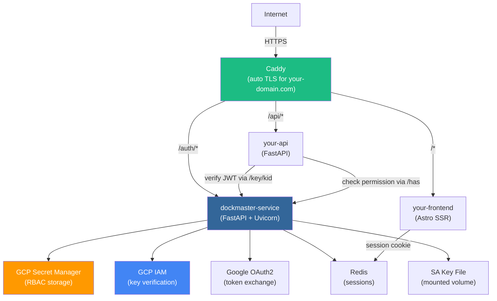

**Key decisions:**

| Decision | Current (GKE) | Target (DO + Compose) |
|----------|---------------|----------------------|
| Web framework | Flask + Gunicorn + gevent | FastAPI + Uvicorn |
| JWT signing | GCP SA RSA key | Same (mounted SA key file) |
| Secrets/RBAC | GCP Secret Manager | Same |
| OAuth provider | Google | Same |
| Sessions | Redis + pickle | Redis + JSON (or in-memory dict for minimal) |
| Key distribution | GCP IAM API enumeration | Same + `/key/<kid>` endpoint |
| Reverse proxy | NGINX Ingress on GKE | Caddy (auto HTTPS) |
| GCP auth from pod | Workload Identity | Mounted SA key file or Workload Identity Federation |
| API docs | watchtower (custom) | FastAPI built-in OpenAPI |
| Build | Cloud Build + Shiv `.pyz` | Multi-stage Dockerfile |

**GCP auth from outside GCP -- two options:**

1. **Mounted SA key file (simpler):** Download a service account JSON key, mount it into the container via Docker volume. Set `GOOGLE_APPLICATION_CREDENTIALS=/etc/secrets/sa-key.json`. You already do this for the `ISSUER` config. Downside: key needs manual rotation.

2. **Workload Identity Federation (keyless):** Configure GCP to trust an external identity provider (e.g., the DO droplet's metadata). More complex setup but no key file to manage. Best if you want to avoid storing keys on disk.

**Sample `docker-compose.yml`:**

```yaml
services:
  caddy:
    image: caddy:2
    ports:
      - "80:80"
      - "443:443"
    volumes:
      - ./Caddyfile:/etc/caddy/Caddyfile
      - caddy_data:/data
    depends_on:
      - auth
      - api
      - frontend

  auth:
    build: ./dockmaster-service
    environment:
      - ISSUER=/etc/secrets/identity.json
      - SECRETS_PROJECT=shipyard-auth-2022
      - AUTHORIZED_ISSUERS=https://accounts.google.com,dock-master@shipyard-auth-2022.iam.gserviceaccount.com
      - AUTHORIZED_DOMAINS=shipyard.com
      - AUTHORIZED_AUDIENCE=109370504310-p2e82hp5cvubrub37jjrbpgabj0ivlnv.apps.googleusercontent.com
      - DEFAULT_CLIENT_ID=109370504310-p2e82hp5cvubrub37jjrbpgabj0ivlnv.apps.googleusercontent.com
      - REDIS_URL=redis://redis:6379
    volumes:
      - ./secrets/identity.json:/etc/secrets/identity.json:ro
    depends_on:
      - redis

  api:
    build: ./your-api
    environment:
      - DOCKMASTER_URL=http://auth:8000
    depends_on:
      - auth

  frontend:
    build: ./your-frontend
    environment:
      - DOCKMASTER_URL=http://auth:8000

  redis:
    image: redis:7-alpine
    volumes:
      - redis_data:/data

volumes:
  caddy_data:
  redis_data:
```

**Sample `Caddyfile`:**

```
auth.your-domain.com {
    reverse_proxy auth:8000
}

api.your-domain.com {
    reverse_proxy api:8000
}

your-domain.com {
    reverse_proxy frontend:4321
}
```

### 5c. Auth Middleware for Consuming Services

Every consuming service needs middleware that handles three auth modes:

1. **Bearer token** -- JWT in `Authorization: Bearer <jwt>` header. Verify directly.
2. **Session cookie** -- session ID in httpOnly cookie, JWT stored server-side (Redis or in-memory). Look up the JWT from the session store and verify.
3. **OAuth redirect** -- no token found anywhere. Redirect to dockmaster's OAuth endpoint. On return, store the issued JWT in the session store and set a session cookie.

Resolution order: Bearer header -> session cookie -> OAuth redirect.

#### Astro SSR Middleware (`src/middleware/auth.ts`)

```typescript
// src/middleware/auth.ts
import { defineMiddleware } from "astro:middleware";
import * as jose from "jose";

const DOCKMASTER_URL = import.meta.env.DOCKMASTER_URL || "http://auth:8000";
const COOKIE_NAME = "sid";
const PUBLIC_ROUTES = ["/", "/login", "/health"];

// In-memory session store (replace with Redis for production)
const sessions = new Map<string, { jwt: string; claims: any; expiresAt: number }>();

// Cache for public keys fetched from dockmaster
const keyCache = new Map<string, { key: string; fetchedAt: number }>();
const KEY_CACHE_TTL = 300_000; // 5 minutes

async function getPublicKey(kid: string): Promise<string | null> {
  const cached = keyCache.get(kid);
  if (cached && Date.now() - cached.fetchedAt < KEY_CACHE_TTL) {
    return cached.key;
  }
  const res = await fetch(`${DOCKMASTER_URL}/key/${kid}`);
  if (!res.ok) return null;
  const key = await res.text();
  keyCache.set(kid, { key, fetchedAt: Date.now() });
  return key;
}

export const onRequest = defineMiddleware(async (context, next) => {
  const { request, cookies, locals, url } = context;

  // Skip public routes
  if (PUBLIC_ROUTES.some((r) => url.pathname === r)) {
    return next();
  }

  // Mode 1: Bearer token
  const authHeader = request.headers.get("Authorization");
  if (authHeader?.startsWith("Bearer ")) {
    const token = authHeader.slice(7);
    try {
      const header = jose.decodeProtectedHeader(token);
      const pem = await getPublicKey(header.kid!);
      if (pem) {
        const pubKey = await jose.importSPKI(pem, "RS256");
        const { payload } = await jose.jwtVerify(token, pubKey);
        (locals as any).user = payload;
        return next();
      }
    } catch {}
    return new Response("Unauthorized", { status: 401 });
  }

  // Mode 2: Session cookie
  const sid = cookies.get(COOKIE_NAME)?.value;
  if (sid) {
    const session = sessions.get(sid);
    if (session && session.expiresAt > Date.now()) {
      (locals as any).user = session.claims;
      return next();
    }
    // Expired session -- clean up and fall through to redirect
    if (session) sessions.delete(sid);
  }

  // Mode 3: OAuth redirect to dockmaster
  const redirectUrl = `${DOCKMASTER_URL}/auth/login?redirect=${encodeURIComponent(url.href)}`;
  return context.redirect(redirectUrl, 302);
});
```

Usage in Astro pages:
```astro
---
// src/pages/dashboard.astro
const user = Astro.locals.user;
---
<h1>Welcome, {user.name}</h1>
```

#### React SPA Auth Module (`src/auth/`)

React is client-side, so it needs a backend-for-frontend (BFF) to manage sessions. The Astro SSR layer above can serve as the BFF, or use a thin Express server.

```typescript
// src/auth/auth-provider.tsx
import { createContext, useContext, useState, useEffect, type ReactNode } from "react";

interface AuthContext {
  user: any | null;
  isAuthenticated: boolean;
  login: () => void;
  logout: () => void;
}

const AuthContext = createContext<AuthContext | null>(null);

export function AuthProvider({ children }: { children: ReactNode }) {
  const [user, setUser] = useState<any | null>(null);

  useEffect(() => {
    // Check if we have a valid session via the BFF
    fetch("/auth/principal", { credentials: "include" })
      .then((r) => r.json())
      .then((data) => {
        if (data.email) setUser(data);
      })
      .catch(() => setUser(null));
  }, []);

  const login = () => {
    // Redirect to dockmaster OAuth via BFF
    window.location.href = `/auth/login?redirect=${encodeURIComponent(window.location.href)}`;
  };

  const logout = () => {
    fetch("/auth/logout", { credentials: "include" }).then(() => {
      setUser(null);
      window.location.href = "/";
    });
  };

  return (
    <AuthContext.Provider value={{ user, isAuthenticated: !!user, login, logout }}>
      {children}
    </AuthContext.Provider>
  );
}

export const useAuth = () => useContext(AuthContext)!;
```

```typescript
// src/auth/auth-fetch.ts
export async function authFetch(url: string, options: RequestInit = {}): Promise<Response> {
  const response = await fetch(url, {
    ...options,
    credentials: "include", // Send session cookie to same-origin BFF
  });

  if (response.status === 401) {
    // Session expired -- redirect to login
    window.location.href = `/auth/login?redirect=${encodeURIComponent(window.location.href)}`;
    throw new Error("Session expired");
  }

  return response;
}
```

The BFF (Astro SSR or Express) receives requests with the session cookie, looks up the JWT from the session store, and forwards requests to backend APIs with `Authorization: Bearer <jwt>`.

#### FastAPI/FastHTML Auth Middleware (`middleware/auth.py`)

```python
# middleware/auth.py
import time
import httpx
from typing import Optional
from fastapi import Request, HTTPException, Depends
from starlette.middleware.base import BaseHTTPMiddleware
from starlette.responses import RedirectResponse
from jose import jwt as jose_jwt, JWTError
from uuid import uuid4

DOCKMASTER_URL = "http://auth:8000"
COOKIE_NAME = "sid"
PUBLIC_ROUTES = {"/", "/health", "/login"}

# --- Key Cache ---

_key_cache: dict[str, tuple[str, float]] = {}
KEY_CACHE_TTL = 300  # seconds


async def get_public_key(kid: str) -> Optional[str]:
    cached = _key_cache.get(kid)
    if cached and time.time() - cached[1] < KEY_CACHE_TTL:
        return cached[0]
    async with httpx.AsyncClient() as client:
        resp = await client.get(f"{DOCKMASTER_URL}/key/{kid}")
        if resp.status_code != 200:
            return None
        key = resp.text
        _key_cache[kid] = (key, time.time())
        return key


# --- Session Store ---
# Replace with Redis for production
_sessions: dict[str, dict] = {}


# --- JWT Verification ---

async def verify_jwt(token: str) -> dict:
    """Verify a JWT by fetching the public key from dockmaster."""
    header = jose_jwt.get_unverified_header(token)
    kid = header.get("kid")
    if not kid:
        raise ValueError("No kid in JWT header")
    pem = await get_public_key(kid)
    if not pem:
        raise ValueError(f"Unknown key {kid}")
    claims = jose_jwt.decode(token, pem, algorithms=["RS256"],
                             options={"verify_aud": False})
    return claims


# --- FastAPI Dependency (API routes -- Bearer only) ---

async def get_current_user(request: Request) -> dict:
    """FastAPI dependency: extracts and verifies JWT from Bearer header or session."""
    # Mode 1: Bearer token
    auth = request.headers.get("Authorization", "")
    if auth.startswith("Bearer "):
        token = auth[7:]
        try:
            return await verify_jwt(token)
        except (JWTError, ValueError):
            raise HTTPException(status_code=401, detail="Invalid token")

    # Mode 2: Session cookie
    sid = request.cookies.get(COOKIE_NAME)
    if sid and sid in _sessions:
        session = _sessions[sid]
        if session.get("expires_at", 0) > time.time():
            return session["claims"]
        del _sessions[sid]

    raise HTTPException(status_code=401, detail="Not authenticated")


# --- Starlette Middleware (browser routes -- Bearer + session + OAuth redirect) ---

class AuthMiddleware(BaseHTTPMiddleware):
    """Full auth middleware for FastHTML/browser-facing apps."""

    async def dispatch(self, request: Request, call_next):
        if request.url.path in PUBLIC_ROUTES:
            return await call_next(request)

        # Handle OAuth callback
        if request.url.path == "/auth/callback":
            return await self._handle_callback(request)

        # Mode 1: Bearer token
        auth = request.headers.get("Authorization", "")
        if auth.startswith("Bearer "):
            try:
                request.state.user = await verify_jwt(auth[7:])
                return await call_next(request)
            except (JWTError, ValueError):
                raise HTTPException(status_code=401, detail="Invalid token")

        # Mode 2: Session cookie
        sid = request.cookies.get(COOKIE_NAME)
        if sid and sid in _sessions:
            session = _sessions[sid]
            if session.get("expires_at", 0) > time.time():
                request.state.user = session["claims"]
                return await call_next(request)
            del _sessions[sid]

        # Mode 3: OAuth redirect
        redirect_url = f"{DOCKMASTER_URL}/auth/login?redirect={request.url}"
        return RedirectResponse(redirect_url, status_code=302)

    async def _handle_callback(self, request: Request):
        """Handle return from dockmaster OAuth -- store JWT in session."""
        token = request.query_params.get("token")
        redirect_to = request.query_params.get("redirect", "/")
        if not token:
            raise HTTPException(status_code=400, detail="No token")

        claims = await verify_jwt(token)
        sid = str(uuid4())
        _sessions[sid] = {
            "claims": claims,
            "jwt": token,
            "expires_at": claims.get("exp", time.time() + 3600),
        }

        response = RedirectResponse(redirect_to, status_code=302)
        response.set_cookie(
            COOKIE_NAME, sid,
            httponly=True, secure=True, samesite="lax",
            max_age=3600,
        )
        return response
```

**FastAPI usage (API only):**
```python
from fastapi import FastAPI, Depends
from middleware.auth import get_current_user

app = FastAPI()

@app.get("/api/experiments")
async def list_experiments(user: dict = Depends(get_current_user)):
    email = user["email"]
    # ... return experiments for this user
```

**FastHTML usage (browser + API):**
```python
from fastapi import FastAPI
from middleware.auth import AuthMiddleware, get_current_user

app = FastAPI()
app.add_middleware(AuthMiddleware)

# Browser routes use request.state.user (set by middleware)
# API routes can also use Depends(get_current_user)
```

### 5c. Integration Topology

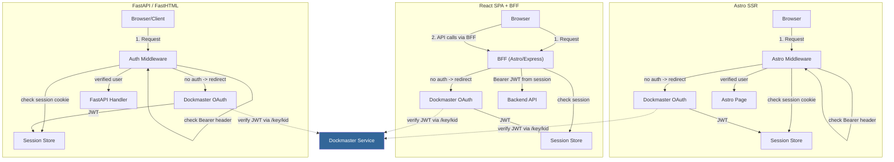

---

## 6. Admin Panel (Web UI)

The dockmaster service includes an unfinished web admin panel for managing RBAC roles and grants. Built with jQuery 3.6 + UIKit 3.x, it has working authentication but zero RBAC CRUD functionality.

**What works:** navbar with login/logout, two-tab layout (Roles, Grants), session expiry detection with re-login modal.

**What's missing:** all role/grant listing, creation, editing, deletion -- both the UI and the backend CRUD endpoints. The `/console/` routes in `service.py` are commented out.

For a reimplementation, the recommended path is to add CRUD endpoints to the dockmaster FastAPI service (the storage layer in `rbac.py` already supports full CRUD) and build the admin UI as a protected route in your Astro or React frontend.

See [10-admin-panel.md](./10-admin-panel.md) for a detailed breakdown of every file, what was planned, and reimplementation options.
