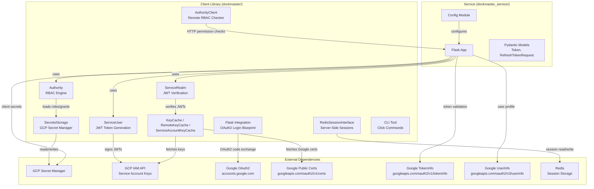
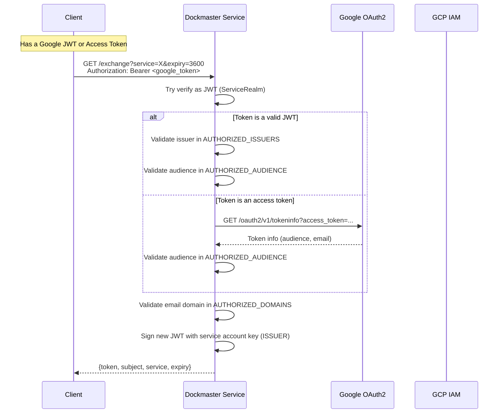
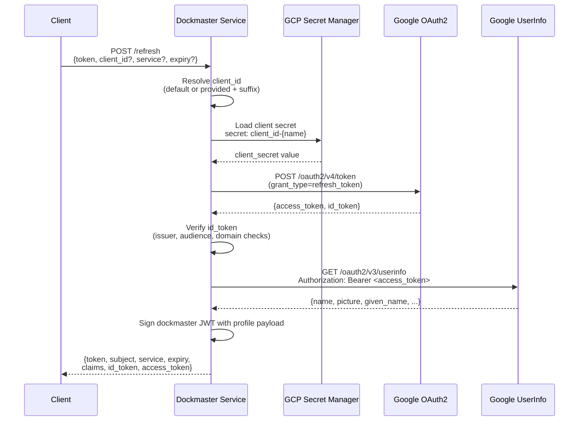
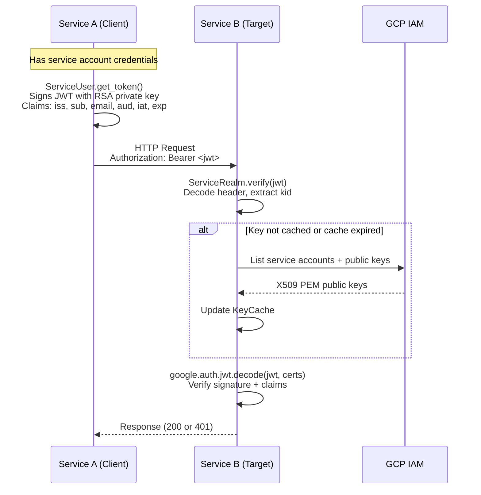
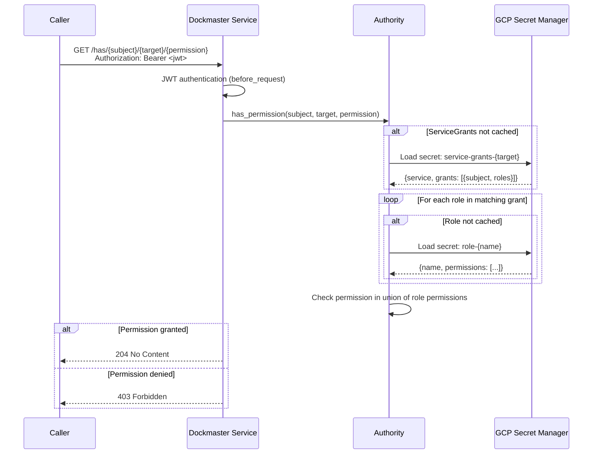
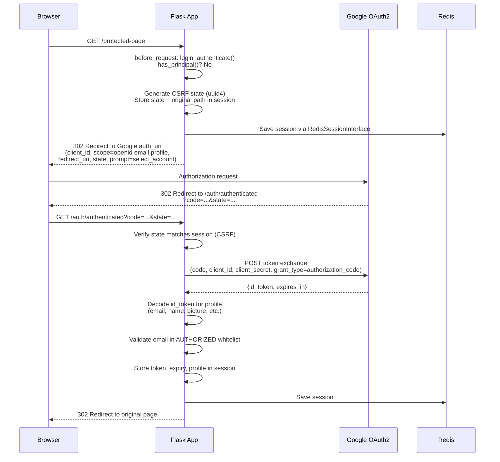
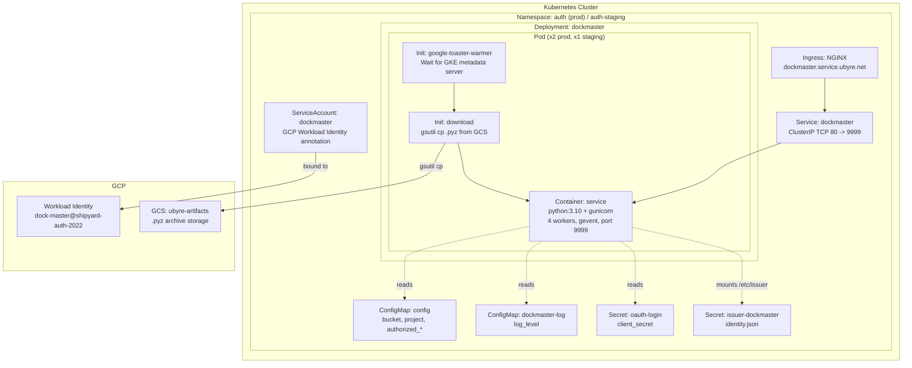

Overall, dockmaster is a well-scoped system with a clear purpose: issue and verify JWTs, check RBAC permissions, and bridge
Google OAuth2 into a custom token scheme. The architecture is straightforward — a stateless Flask service backed by GCP Secret
Manager for RBAC storage, with a companion client library for consuming applications.

It maps very cleanly to FastAPI. Here's why:

The service is essentially 6 REST endpoints with no complex request lifecycle. Flask's before_request becomes a FastAPI
Depends() that returns verified claims. Flask's g object (used for per-request Authority, realm, etc.) becomes injected
dependencies — which is actually a much cleaner pattern. The get_config() function chain maps directly to Pydantic BaseSettings
with environment variable loading, eliminating the awkward dual env-var-vs-Flask-config resolution that currently has
inconsistent ordering bugs.

The RBAC layer (rbac.py), the client library (client.py, target.py), and the CLI (__main__.py) are all framework-independent.
They don't import Flask at all. You can lift them into a FastAPI project unchanged. The only Flask-coupled code is
flask_integration.py (OAuth2 login blueprint + session management) and service.py itself.

Things that will actually improve in the migration:

- The per-request SecretManagerServiceClient creation is the biggest performance problem. FastAPI's dependency injection with
@lru_cache or app lifespan makes it natural to create a single client at startup and share it across requests.
- The can_issue bug in /refresh (flag set but never checked) and the mutable default payload={} in get_token() are the kind of
things you'd catch naturally when rewriting, since you'd be writing tests for each endpoint.
- Pydantic v2 request/response models replace the loose request.json + unmarshaller pattern and give you automatic validation,
eliminating the unhandled None/malformed JSON cases.
- The inconsistent error response formats ({"error": "..."} vs {"status": "Error", "message": "..."}) can be unified with a
single HTTPException handler.

The one area that needs architectural thought is the Flask OAuth2 login blueprint with server-side sessions. If a consuming
application needs the Google SSO login flow (browser redirect → callback → session cookie), that's the most Flask-specific
piece. FastAPI can handle it with authlib or httpx-oauth, but the session management pattern is different — you'd likely use
signed cookies or a lightweight session middleware instead of the Redis-backed pickle sessions. That said, the dockmaster service
itself doesn't even use this code (the console UI is disabled), so it's only relevant for the client library.

Bottom line: this is a good candidate for FastAPI migration. The core logic is clean and portable, the Flask coupling is
shallow, and several of the documented bugs and performance issues would be naturally resolved by FastAPI's patterns. The 15
known issues I cataloged are mostly minor — the biggest risk is the /refresh security gap, which is a one-line fix regardless of
framework.

---

# Dockmaster System Documentation

## Master Outline & Architecture Reference

---

## 1. Executive Summary

### What is Dockmaster?

Dockmaster is a GCP-native authentication and authorization system composed of two components:

1. **A Python client library** (`dockmaster/`, v0.14.0) -- Provides service-to-service JWT authentication, OAuth2 integration, role-based access control (RBAC), Flask web framework integration, and a CLI for managing roles and permissions. Any Python service can use this library to issue JWTs from GCP service account keys, verify incoming JWTs against cached public keys, enforce RBAC permissions via a centralized authority backed by GCP Secret Manager, and integrate Google SSO login.

2. **A Flask microservice** (`service/dockmaster_service/`, v0.12.3) -- Acts as a centralized authentication gateway. It exchanges Google-issued tokens (JWTs, access tokens, refresh tokens) for internally-signed dockmaster JWTs, exposes RBAC permission checks as HTTP endpoints, and serves public keys for distributed JWT verification. It runs on Kubernetes with GCP Workload Identity, deployed via Cloud Build and a Redis-based deployment queue.

### Core Capabilities

| Capability | Component | Description |
|---|---|---|
| JWT Token Issuance | Client Library | Sign JWTs using GCP service account private keys |
| JWT Token Verification | Client Library + Service | Verify JWTs against cached public keys (GCP IAM + Google OIDC certs) |
| Google Token Exchange | Service | Exchange Google JWTs or access tokens for dockmaster JWTs |
| Google Refresh Token Flow | Service | Exchange Google refresh tokens for dockmaster JWTs with profile enrichment |
| RBAC Permission Checks | Client Library + Service | Role/permission model backed by GCP Secret Manager, exposed via HTTP |
| Public Key Distribution | Service | Serve public keys at `/key/{kid}` for decentralized JWT verification |
| Google SSO Login | Client Library | Flask Blueprint for browser-based OAuth2 login with Redis-backed sessions |
| CLI Management | Client Library | Click-based CLI for managing roles, grants, and testing permissions |

### Purpose of This Documentation

This document suite is designed to enable a developer to **recreate the dockmaster system using FastAPI and modern Python packages** instead of Flask. Each section documents the existing implementation in sufficient detail to understand every flow, endpoint, data model, and configuration option. The final section provides a complete Flask-to-FastAPI migration guide.

### Technology Stack

| Layer | Current Technology |
|---|---|
| Web Framework | Flask |
| API Documentation | watchtower (custom OpenAPI wrapper) |
| Data Validation | Pydantic v2 |
| Session Storage | Redis (via custom `RedisSessionInterface`) |
| JWT Signing/Verification | `google-auth` (`google.auth.jwt`, `google.auth.crypt`) |
| GCP Key Management | `google-api-python-client` (IAM API) |
| RBAC Storage | `google-cloud-secret-manager` |
| HTTP Client | `requests` with retry adapter |
| CLI | Click |
| WSGI Server | Gunicorn + gevent workers |
| Container Runtime | Python 3.10 on Kubernetes |
| Packaging | shiv (zipapp `.pyz` archives) |
| CI/CD | Google Cloud Build |
| Ingress | NGINX Ingress Controller |
| Identity | GCP Workload Identity |

---

## 2. Architecture

### 2.1 System Architecture

### 2.2 OAuth2 Token Exchange Flow

The `/exchange` endpoint accepts a Google-issued JWT or access token and returns a dockmaster-signed JWT.

### 2.3 Refresh Token Flow

The `/refresh` endpoint accepts a Google refresh token, exchanges it for new Google tokens, validates them, fetches the user profile, and issues a dockmaster JWT.

### 2.4 Service-to-Service JWT Authentication

### 2.5 RBAC Permission Check Flow

### 2.6 Google SSO Login Flow (Flask Integration)

The client library provides a Flask Blueprint for browser-based OAuth2 login, used by Flask apps that consume the dockmaster library (the console UI in the service is currently disabled).

### 2.7 Deployment Pipeline

```mermaid
flowchart LR
    A[Git Push / Tag] --> B[Cloud Build Trigger]
    B --> C[Install build deps<br/>shiv, setuptools]
    C --> D[Build .pyz archive<br/>gunicorn + gevent + app]
    D --> E[Upload to GCS<br/>gs://ubyre-artifacts/]
    E --> F[Load secrets from<br/>Secret Manager]
    F --> G[Generate Kustomize<br/>manifests]
    G --> H[kubectl kustomize<br/>-> service_deploy.yaml]
    H --> I[Upload deploy YAML<br/>to GCS]
    I --> J[Push to Redis<br/>deploy queue<br/>XADD deploy-target]
    J --> K[Slack notification]
```

### 2.8 Kubernetes Architecture

---

## 3. Document Outline

The sections below will each become a separate detailed markdown file. Sub-items show the specific topics covered in each document.

---

### 3.1 Client Library: Authentication (`client.py`)
**File**: [`docs/02-client-authentication.md`](02-client-authentication.md)

- **`requests_retry_session()`** -- HTTP client factory with exponential backoff retry
  - Parameters: retries, backoff_factor, status_forcelist
  - Uses `urllib3.Retry` + `requests.adapters.HTTPAdapter`

- **`ServiceUser` class** -- JWT token generation from GCP service account credentials
  - Constructor: accepts file path (str) or dict credentials, extracts `client_email`
  - `get_token(subject, service_name, expiry, payload)` -- builds and signs JWT
  - `get_authorization(...)` -- returns `"Bearer <token>"` string
  - JWT claim structure: `iss`, `sub`, `email`, `aud`, `iat`, `exp`
  - Signing mechanism: `google.auth.crypt.RSASigner` + `google.auth.jwt.encode()`

- **`AuthorityClient` class** -- Remote RBAC permission checker via HTTP
  - Constructor: service URL + ServiceUser for auth
  - `has_permission(subject, target, permission)` -- GET `/has/{s}/{t}/{p}` with Bearer token

- **`check_access_token()` function** -- Google access token validation
  - Calls tokeninfo endpoint, validates audience against allow list
  - Returns `(valid: bool, message: str, info: dict|None)`

---

### 3.2 Client Library: Token Verification (`target.py`)
**File**: [`docs/03-token-verification.md`](03-token-verification.md)

- **`KeyCache` base class** -- In-memory key dict with time-based expiry
  - Configurable expiry (default 300s)
  - `__getitem__` triggers `update()` if cache is stale
  - Template method pattern: subclasses override `update()`

- **`RemoteKeyCache(KeyCache)`** -- On-demand key fetching from dockmaster service
  - Lazy-loads keys via `GET /key/{kid}` with Bearer auth
  - Uses ServiceUser for authentication

- **`ServiceAccountKeyCache(KeyCache)`** -- GCP IAM public key cache
  - Loads all service account public keys in a GCP project via IAM API
  - Optionally loads Google OAuth2 public certs from `googleapis.com/oauth2/v1/certs`
  - `public_keys()` generator: yields `(email, kid, pem_key)` tuples

- **`ServiceRealm` class** -- JWT verification realm
  - Constructor: requires `KeyCache`, optional `Authority`
  - `verify(jwt_value, audience)` -- decodes header, extracts `kid`, verifies with `google.auth.jwt.decode()`
  - `has_permission(subject, target, permission)` -- delegates to Authority
  - Error handling: raises `ValueError` for invalid JWT structure, unknown key, failed verification

---

### 3.3 Client Library: RBAC (`rbac.py`)
**File**: [`docs/04-rbac.md`](04-rbac.md)

- **`SecretsStorage` class** -- GCP Secret Manager CRUD backend
  - Secret naming: `{category}-{name}` (e.g., `role-admin`, `service-grants-myapp`)
  - Methods: `exists()`, `load()`, `save()`, `delete()`
  - `load()` accesses `latest` version, deserializes JSON via `from_data()`
  - `save()` creates secret if needed, adds new version

- **`Entity` base class** -- Storable entity pattern
  - Class attributes: `category` (str), `name` (str field name)
  - Class methods: `exists()`, `delete()`, `load()` delegating to storage
  - Instance method: `save()`

- **`Role(Entity)` dataclass** -- RBAC role definition
  - Fields: `name`, `permissions: list[str]`
  - Secret pattern: `role-{name}`

- **`Grant` dataclass** -- Role grant to a subject (nested, not an Entity)
  - Fields: `subject: str`, `roles: list[str]`

- **`ServiceGrants(Entity)` dataclass** -- Collection of grants for a service
  - Fields: `service: str`, `grants: list[Grant]`
  - Secret pattern: `service-grants-{service}`

- **`Authority` class** -- RBAC permission engine with caching
  - Loads ServiceGrants, resolves roles, accumulates permission sets
  - `has_permission(subject, target, permission)` -- checks union of role permissions
  - Caching: roles and permissions cached within Authority instance lifetime

---

### 3.4 Client Library: Flask Integration (`flask_integration.py`, `sessions.py`)
**File**: [`docs/05-flask-integration.md`](05-flask-integration.md)

- **JWT Authentication Middleware**
  - `get_bearer_token()` -- extracts Bearer token from Authorization header
  - `jwt_authenticate(realm)` -- verifies JWT, sets `request.environ['REMOTE_USER']`

- **OAuth2 Login Flow (Google SSO)**
  - Flask config keys: `AUTH_PROVIDER`, `TOKEN_PROVIDER`, `CLIENT_ID`, `CLIENT_SECRET`, `HOST_URL`, `AUTHORIZED`, `EXPIRY`, `NOAUTH`, `NOAUTH_PREFIXES`
  - `auth_uri()` -- builds Google authorization URL with CSRF state + nonce
  - `exchange_code(code)` -- POST to token endpoint, returns token response
  - `get_principal(token)` -- base64-decodes JWT claims (no signature verification)
  - `has_principal()` -- checks session for valid non-expired token
  - `login_authenticate()` -- before_request hook, skips NOAUTH paths, redirects unauthenticated users

- **Flask Blueprint: `auth_endpoint` (prefix `/auth`)**
  - `GET /auth/authenticated` -- OAuth2 callback: verify state, exchange code, set session, redirect
  - `GET /auth/logout` -- clear session, redirect to APP_ROOT
  - `GET /auth/login` -- clear session, redirect to APP_ROOT
  - `GET /auth/principal` -- return current user profile as JSON

- **`RedisSessionInterface` (server-side sessions)**
  - `ServerSideSession` -- extends `CallbackDict` + `SessionMixin`, tracks `modified` flag
  - `open_session()` -- read cookie, load from Redis (pickle deserialization)
  - `save_session()` -- pickle serialize, store in Redis with TTL, set httponly/secure cookie
  - Key pattern: `session:{sid}`

---

### 3.5 Service: Configuration and Startup
**File**: [`docs/06-service-configuration.md`](06-service-configuration.md)

- **`Config` class** -- static defaults
  - `APP_ROOT`, `AUTH_PREFIX`, `AUTH_PROVIDER`, `TOKEN_PROVIDER`, `CLIENT_ID`, `REDIRECT_URI`, `SESSION_KEY`
  - `NOAUTH = []`, `NOAUTH_PREFIXES = ['/console/assets']`

- **`get_config()` pattern** -- env var -> Flask config -> default fallback

- **Lazy initialization via Flask `g`**
  - `get_realm()` -- creates `ServiceRealm` per-request, cached in `g.realm`
  - `get_authority()` -- creates `Authority(SecretsStorage(...))` per-request, cached in `g.authority`
  - `get_key_cache()` -- module-level singleton `ServiceAccountKeyCache`
  - `get_credentials()`, `get_client()` -- GCP credential and Secret Manager client factories

- **Authorization configuration helpers**
  - `get_authorized_issuers()` -- comma-separated trusted JWT issuers
  - `get_authorized_domains()` -- comma-separated allowed email domains
  - `get_authorized_audience()` -- comma-separated allowed JWT audiences
  - `get_default_client_id()`, `get_client_id_suffix()` -- for refresh flow client ID resolution

- **Google endpoint helpers**
  - `get_access_token_endpoint()` -- tokeninfo URL
  - `get_refresh_token_endpoint()` -- token refresh URL
  - `get_userinfo_endpoint()` -- userinfo URL

- **Dynamic config loading** -- `SERVICE_CONFIG` env var for custom config class
- **API documentation** -- `watchtower` API instance with Pydantic model registration

---

### 3.6 Service: API Endpoints
**File**: [`docs/07-service-endpoints.md`](07-service-endpoints.md)

- **Authentication middleware (`before_request`)**
  - Skips: `/exchange`, `/refresh`, `/apidocs`, `/apispec`
  - All other routes: `jwt_authenticate(realm)` -- requires valid Bearer JWT

- **`GET /exchange`** -- Token Exchange
  - Input: Bearer token (Google JWT or access token), query params `service`, `expiry`
  - Validation: issuer whitelist, audience whitelist, email domain whitelist
  - Output: `Token {token, subject, service, expiry}`

- **`POST /refresh`** -- Refresh Token Exchange
  - Input: JSON body `RefreshTokenRequest {token, client_id?, service?, expiry?}`
  - Client secret loaded from Secret Manager by client_id
  - Output: `Token` with additional `claims`, `id_token`, `access_token`

- **`GET /has/<subject>/<target>/<permission>`** -- Path-based RBAC Check
  - Returns 204 (granted) or 403 (denied)

- **`GET /has?subject=...&target=...&permission=...`** -- Query-based RBAC Check
  - Same logic, query parameter validation (400 if missing)

- **`GET /key/<kid>`** -- Public Key Retrieval
  - Returns PEM key with `Content-Type: application/x-pem-file`
  - Returns 404 if not found

- **`GET /claims`** -- JWT Claims Inspection
  - Returns verified JWT claims from `request.environ['REMOTE_USER']`

- **Pydantic models** (`message.py`)
  - `Token`: token, subject, service, expiry, claims, access_token, id_token
  - `RefreshTokenRequest`: token, client_id, service, expiry

---

### 3.7 Service: Token Exchange and Refresh Flows (Deep Dive)
**File**: [`docs/08-token-flows.md`](08-token-flows.md)

- **Exchange flow step-by-step**
  - Bearer token extraction -> JWT verification attempt -> access token fallback
  - Issuer/audience/domain validation chain
  - Profile claim copying (name, picture, given_name, family_name, locale)
  - JWT signing with `ServiceUser(issuer_credentials)`

- **Refresh flow step-by-step**
  - Client ID resolution: append `.apps.googleusercontent.com` if no `.`
  - Secret lookup: `client_id-{name_before_first_dot}`
  - Google refresh endpoint call
  - Post-refresh id_token validation
  - UserInfo profile enrichment via Google UserInfo API

- **Error scenarios and HTTP status codes**
  - 400: missing parameters, invalid client_id
  - 401: unauthenticated, invalid token, refresh failed
  - 403: issuer/audience/domain not allowed
  - 500: internal exception
  - 503: ISSUER not configured

---

### 3.8 Service: RBAC Endpoints (Deep Dive)
**File**: [`docs/09-rbac-endpoints.md`](09-rbac-endpoints.md)

- **Permission check flow** -- Authority lifecycle per request
- **RBAC data model in Secret Manager** -- JSON schemas for Role and ServiceGrants
- **Caching behavior** -- Authority created per-request via Flask `g`, no cross-request cache
- **Path-based vs query-based endpoint** -- identical logic, different parameter source

---

### 3.9 CLI Tool (`__main__.py`)
**File**: [`docs/11-cli-tool.md`](11-cli-tool.md)

- **`dockmaster role` command** -- get, create, delete, add, remove operations
- **`dockmaster service` command** -- get, delete, grant, revoke operations
  - Target format: `subject:role1,role2`
  - Wildcard revocation with `*`
- **`dockmaster test` command** -- test permission check ("Oui!" / "Non!")
- **`dockmaster token` command** -- generate JWT from keyfile
- Default project: `shipyard-auth-2022`
- Framework: Click (framework-independent, no migration needed)

---

### 3.10 Infrastructure and Deployment
**File**: [`docs/12-infrastructure.md`](12-infrastructure.md)

- **Kubernetes Kustomize structure**
  - `base/` -- Deployment (2 replicas), Service (80->9999), ServiceAccount
  - `config/` -- ConfigMap from properties, resource limits, Workload Identity
  - `staging/` -- namespace `auth-staging`, 1 replica, debug logging, staging ingress
  - `prod/` -- namespace `auth`, 2 replicas, info logging, production ingress

- **Init containers**
  - `google-toaster-warmer` -- waits for GKE metadata server
  - `download` -- fetches `.pyz` archive from GCS, creates `run.sh`

- **Gunicorn configuration** -- 4 workers, gevent, 600s timeout, port 9999

- **Cloud Build pipeline** (`deploy.yaml`)
  - Build shiv archive -> upload to GCS -> inject secrets -> generate Kustomize manifests -> upload deploy YAML -> Redis deploy queue -> Slack notification

- **Secrets used in build**
  - `catteldog-oauth-client-secret`, `dockmaster-service-key-prod`, Redis deploy credentials

- **Environment variables** -- ISSUER, SECRETS_PROJECT, AUTHORIZED_*, DEFAULT_CLIENT_ID, CLIENT_SECRET, LOG_LEVEL

- **Network architecture**
  - NGINX ingress: `dockmaster.service.ubyre.net` (prod) / `dockmaster.service.staging.ubyre.net` (staging)
  - Service: ClusterIP, TCP 80 -> 9999

---

### 3.11 Migration Guide: Flask to FastAPI
**File**: [`docs/13-migration-guide.md`](13-migration-guide.md)

- **Dependency changes** -- remove flask/watchtower, add fastapi/uvicorn/httpx
- **Pattern mapping table** -- Flask -> FastAPI equivalents for all patterns
- **Authentication dependency design** -- FastAPI `Depends()` for JWT verification
- **Configuration** -- Pydantic `BaseSettings` replacing Flask config + `get_config()` pattern
- **Session management strategy** -- options for Redis-backed ASGI sessions
- **ASGI server configuration** -- Gunicorn + UvicornWorker replacing gevent
- **Deployment changes** -- shiv entry point, K8s container args
- **Step-by-step migration order** (10 steps)
- **Testing strategy** -- FastAPI TestClient with httpx

---

### Appendices

#### A. Environment Variable Reference
**File**: [`docs/A-env-vars.md`](A-env-vars.md)

Complete table of all environment variables: `ISSUER`, `SECRETS_PROJECT`, `AUTHORIZED_ISSUERS`, `AUTHORIZED_DOMAINS`, `AUTHORIZED_AUDIENCE`, `DEFAULT_CLIENT_ID`, `CLIENT_ID_SUFFIX`, `CLIENT_SECRET`, `LOG_LEVEL`, `SERVICE_CONFIG`, `ACCESS_TOKEN_ENDPOINT`, `REFRESH_TOKEN_ENDPOINT`, `USERINFO_ENDPOINT`, `HOST_URL`, `REDIRECT_URI`, `REDIRECT_PREFIX`, `DOCKMASTER_EXPIRY`

#### B. Secret Manager Entity Catalog
**File**: [`docs/B-secrets-catalog.md`](B-secrets-catalog.md)

Naming conventions (`role-{name}`, `service-grants-{service}`, `client_id-{name}`), JSON schemas for each entity type, GCP project configuration.

#### C. API Specification (OpenAPI)
**File**: [`docs/C-api-spec.md`](C-api-spec.md)

Full OpenAPI 3.0 specification for all service endpoints with request/response schemas, authentication requirements, and status code semantics.

#### D. Example Scripts and Usage
**File**: [`docs/D-examples.md`](D-examples.md)

Walkthrough of `get_token_dockmaster.py`, `get_token_google.py`, `get_token_jwt.py`, `google_refresh.py`, and `authentication.ipynb`.

---

## 4. Source File Reference

| Source File | Documented In |
|---|---|
| `dockmaster/__init__.py` | 3.1 - 3.4 (public API exports) |
| `dockmaster/client.py` | 3.1 Client Authentication |
| `dockmaster/target.py` | 3.2 Token Verification |
| `dockmaster/rbac.py` | 3.3 RBAC |
| `dockmaster/flask_integration.py` | 3.4 Flask Integration |
| `dockmaster/sessions.py` | 3.4 Flask Integration |
| `dockmaster/__main__.py` | 3.9 CLI Tool |
| `service/dockmaster_service/__init__.py` | 3.5 Service Configuration |
| `service/dockmaster_service/config.py` | 3.5 Service Configuration |
| `service/dockmaster_service/message.py` | 3.6 Service Endpoints |
| `service/dockmaster_service/service.py` | 3.6 - 3.8 Service Endpoints/Flows |
| `service/dockmaster_service/templates/` | 3.4 Flask Integration (console UI, currently disabled) |
| `service/dockmaster_service/assets/` | 3.4 Flask Integration (console UI, currently disabled) |
| `k8s/service/**` | 3.10 Infrastructure |
| `service/deploy.yaml` | 3.10 Infrastructure |
| `service/cloudbuild.yaml` | 3.10 Infrastructure |
| `build.yaml` | 3.10 Infrastructure |
| `examples/*` | Appendix D |
| `pyproject.toml`, `setup.cfg` | 3.10 Infrastructure |
