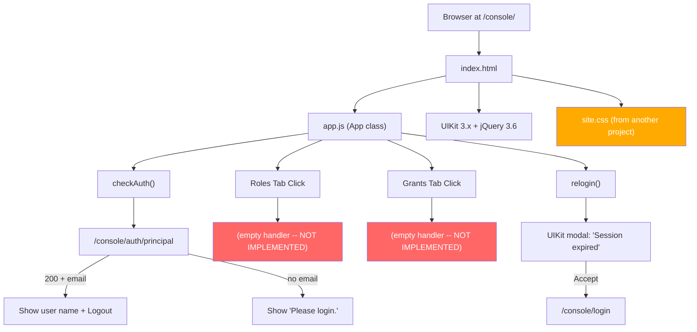
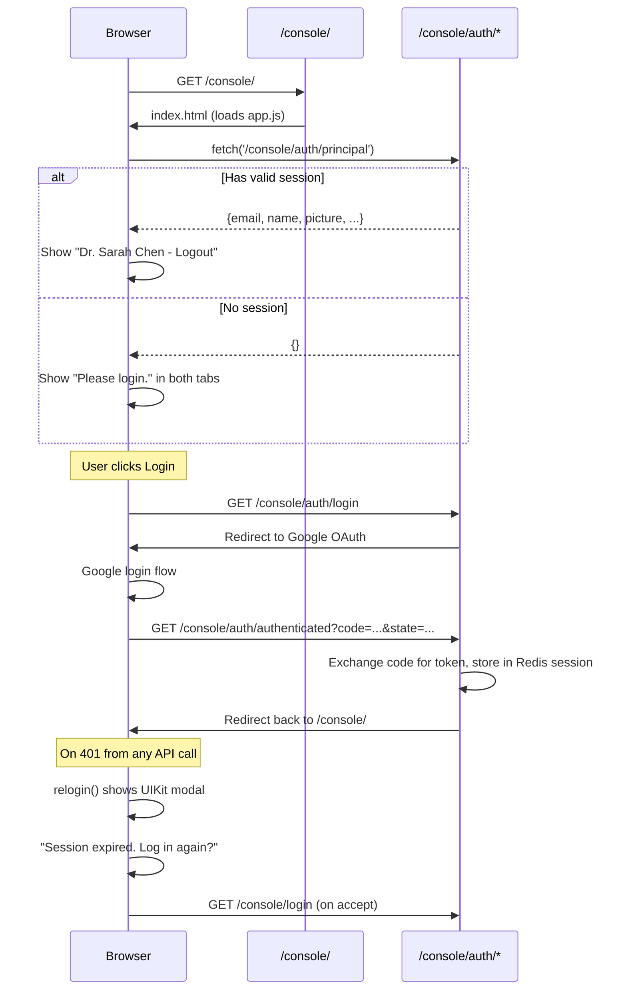
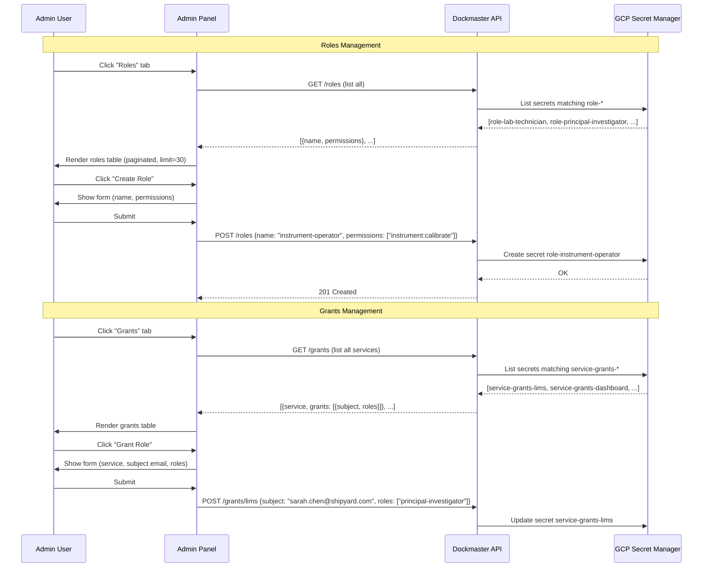
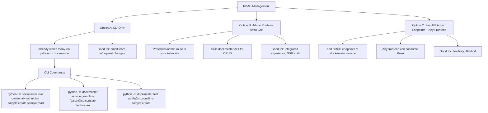

# Dockmaster Admin Panel UI

The dockmaster service includes a lightweight web-based admin panel for managing RBAC roles and grants. It was built with jQuery 3.6 + UIKit 3.x and served from the `/console/` route. **It is a skeleton** -- the authentication framework works, the layout is complete, but the actual RBAC management UI was never implemented.

## Current State



### What Works

| Feature | Status | Details |
|---------|--------|---------|
| Page layout | Done | Navbar with login/logout, two-tab switcher (Roles, Grants) |
| Auth check | Done | `checkAuth()` fetches `/auth/principal`, shows user name or "Please login" |
| Login/Logout | Done | Redirects to `/console/auth/login` and `/console/auth/logout` |
| Session expiry | Done | Detects 401 responses, shows modal offering re-login |
| UIKit framework | Loaded | CSS, JS, and icon library all present |

### What's Missing

| Feature | Status | Details |
|---------|--------|---------|
| Role listing | Not started | No API call, no table rendering |
| Role CRUD | Not started | No create/edit/delete forms or handlers |
| Grant listing | Not started | No API call, no table rendering |
| Grant CRUD | Not started | No create/edit/delete forms or handlers |
| Backend CRUD endpoints | Not started | `service.py` only has `/has` for permission checks, no role/grant management endpoints |
| Console routes | Commented out | Lines 382-389 in `service.py`: `/console/` and `/console/assets/` routes are commented out |
| CSS styles | Wrong project | `site.css` contains styles for `.biolector-card`, `table.experiments`, `table.tasks` -- copied from a lab equipment monitoring project |

## File Inventory

```
service/dockmaster_service/
  templates/
    index.html          # 41 lines -- navbar + 2 empty tab panels
  assets/
    js/
      app.js            # 99 lines -- App class: auth works, CRUD empty
      jquery-3.6.0.min.js   # vendored
      uikit.min.js          # vendored (UIKit 3.x)
      uikit.js              # vendored (unminified)
      uikit-icons.min.js    # vendored
      uikit-icons.js        # vendored (unminified)
    css/
      site.css          # 80 lines -- styles from biolector/experiments project
      uikit.min.css         # vendored
      uikit.css             # vendored (unminified)
      uikit-rtl.min.css     # vendored (RTL variant)
      uikit-rtl.css         # vendored (unminified RTL)
```

## How the Auth Flow Works (the part that IS implemented)



## What Was Planned

Based on the tab structure, data attributes, and response filters in `app.js`, the intended design was:



### Missing Backend Endpoints

None of these exist in `service.py` -- they would need to be created:

| Endpoint | Method | Purpose |
|----------|--------|---------|
| `/roles` | GET | List all roles |
| `/roles/{name}` | GET | Get a specific role |
| `/roles/{name}` | POST | Create a role |
| `/roles/{name}` | PUT | Update a role's permissions |
| `/roles/{name}` | DELETE | Delete a role |
| `/grants` | GET | List all service grants |
| `/grants/{service}` | GET | Get grants for a service |
| `/grants/{service}` | POST | Add/update grants for a service |
| `/grants/{service}/{subject}` | DELETE | Revoke a subject's grants |

The underlying storage logic already exists in `rbac.py` (`SecretsStorage.load`, `.save`, `.delete`) and the CLI (`__main__.py`) already does CRUD via these classes. The backend endpoints would just expose the same operations over HTTP.

## Reimplementation Options



### Recommendation

For a reimplementation, **Option C** (FastAPI CRUD endpoints) is the foundation regardless of frontend choice. The existing `rbac.py` classes (`Role`, `Grant`, `ServiceGrants`, `Authority`, `SecretsStorage`) and CLI logic in `__main__.py` provide the complete storage layer -- the FastAPI endpoints are thin wrappers around these.

If you build a UI, it can live as a protected route in your Astro site (Option B) that calls these API endpoints. The CLI remains useful for scripting and CI/CD.
